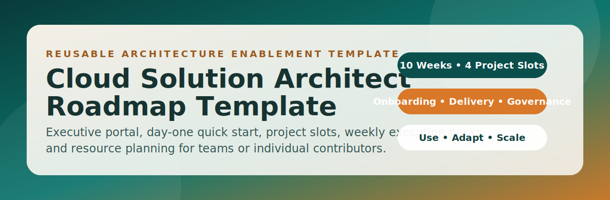

# Generic CSA Learning Roadmap Template

This project is a reusable version of a Cloud Solution Architect learning and delivery roadmap that anyone can adopt.

## Public version

The public version of this repository is available at:

- `https://github.com/fbabaei/csa-roadmap-template`

If you are reading the private/internal EMU copy, use the public repository when you need a shareable external link.

## Visual assets

- Repository banner: `assets/csa-roadmap-template-banner.svg`
- Prepared social-preview asset: `assets/csa-roadmap-template-social-preview.svg`

If you want the GitHub repository social preview image updated in Settings, upload the prepared social-preview asset manually in the repository social preview settings.

## Contributing

See [CONTRIBUTING.md](CONTRIBUTING.md) for contribution workflow, validation expectations, and issue usage.

## Who this is for

- Individual engineers transitioning into architecture roles
- Team leads building a shared upskilling path
- Managers tracking architecture capability growth
- New hires onboarding into Azure, AI, and platform engineering

## What is included

- A 10-week, phase-based roadmap with reusable milestone structure
- Generic project slots (Architecture, AI, Operations, Delivery)
- A browser-based intro portal (`index.html`) for executives and new readers
- Templates for executive summary, plan, resource matrix, and onboarding
- Week-by-week folders with assignment and status placeholders
- **Skill gap analysis** — a 25-domain Azure CSA assessment template and `scripts/analyze_gaps.py` that maps your gaps to specific weeks and project slots

## Quick start

Run commands from the repository root folder so relative paths resolve correctly.

1. Run `python scripts/start_portal.py` to start the local portal and open it in your browser.
2. If your shell is not in repo root, run `powershell -ExecutionPolicy Bypass -File scripts/start_portal_from_anywhere.ps1`.
3. Follow `START_HERE.md` for first-clone onboarding flow.
4. Follow `QUICKSTART.md` for a day-one execution walkthrough.
5. Fill `docs/PLAN_TEMPLATE.md` with your team or personal target outcomes.
6. Define your project examples in `projects/INDEX.md`.
7. Update each `week-XX/STATUS.md` as you execute.
8. Keep evidence links in each week folder and project folder.

## Internal quality bar example

For internal rollout quality consistency, use this completed sample as a reference:

- `docs/WEEK_01_COMPLETED_EXAMPLE.md`

## New user guide

If this is your first time using the template, follow this order:

1. Run `python scripts/start_portal.py` and keep the terminal open.
2. Read `START_HERE.md` then `QUICKSTART.md` and complete the day-one setup sequence.
3. Fill `docs/PLAN_TEMPLATE.md` with owner, timeline, pace, and success criteria.
4. Map your real projects into `projects/INDEX.md` and update the four project slot README files.
5. Start execution in `week-01/WEEK_ASSIGNMENT.md` and `week-01/STATUS.md`.
6. Draft leadership visibility in `docs/EXECUTIVE_SUMMARY_TEMPLATE.md` and your first resource map in `docs/RESOURCE_MATRIX_TEMPLATE.md`.

## Internal release notes

- CI in this template supports two internal modes:
	- GitHub-hosted runner for non-EMU/public owner forks.
	- Self-hosted Linux runner for the `fbabaei_microsoft` owner path.
- If validation fails immediately in the internal repo, confirm a self-hosted runner is online and assigned.
- Gap Analysis profiles in the portal include both real and sample datasets:
	- `Current (gap_report.js)` is your exported assessment data.
	- `Junior CSA`, `Mid-Level Architect`, and `Team Baseline` are sample profiles for demo/baseline comparison.

Use this mental model as you work:

- `Portal and overview` for orientation
- `Templates and project slots` for planning
- `Week folders` for execution and evidence

## Day-one guide

Use this file for a practical setup sequence from first open to first weekly execution:

- `QUICKSTART.md`

## Suggested usage modes

- Standard pace: 10 weeks (1 week per module)
- Accelerated pace: 6 weeks (merge related weeks)
- Extended pace: 14-16 weeks (deeper implementation per week)

## Core status model

- Not Started
- In Progress
- Completed
- Blocked

## Folder map

- `docs/` reusable templates and guidance
- `infra/` infrastructure patterns and modules placeholder
- `projects/` generic project slots and index
- `week-01` to `week-10` execution packs

## Optional customization

Create a copy of this folder and rename it for your cohort, team, or individual plan, for example:

- `csa-roadmap-template-team-a`
- `csa-roadmap-template-2026`
- `cloud-architecture-upskilling-program`
